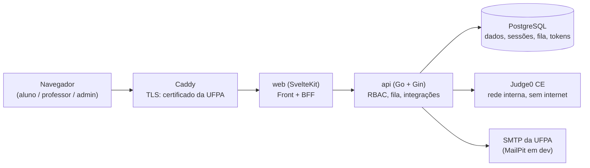
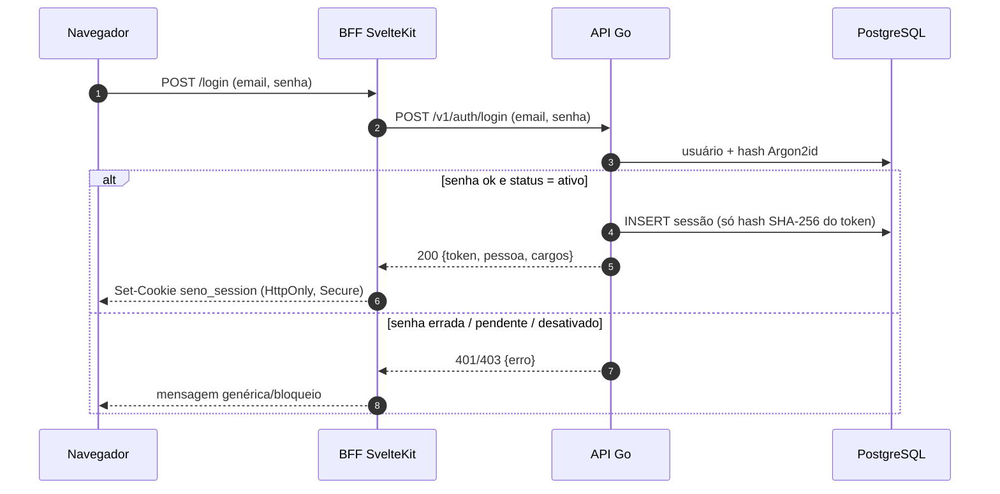
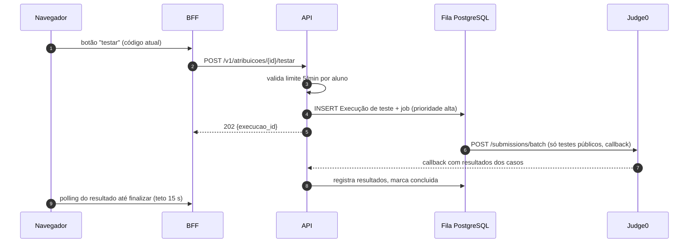

# Arquitetura do Seno

Este documento descreve **como** o sistema é estruturado. O **o quê** (entidades, regras de negócio, fluxos de produto) está definido em [PROJETO.md](PROJETO.md); este documento não o duplica, apenas o referencia.

Decisões registradas (com as escolhas feitas nesta sessão): monorepo; sessão opaca persistida no PostgreSQL; fila de jobs no PostgreSQL; acesso a dados com pgx + sqlc; Caddy como proxy com certificado real da UFPA; senhas com Argon2id; CI/CD com GitHub Actions + GHCR; SMTP ainda indefinido (configurado por `.env`).

## 1. Visão geral

O Seno é um sistema **local** (rede da UFPA, sem nuvem), composto por cinco serviços em Docker:



| Serviço | Papel |
|---|---|
| **Caddy** | Único ponto de entrada (HTTPS 443). Expõe o certificado real da UFPA e só encaminha para o `web`. |
| **web** | Servidor SvelteKit: atende as páginas e atua como **BFF** (sessão/cookie, agregação de chamadas). O front no navegador nunca fala com a API. |
| **api** | Único dono da regra de negócio: autenticação, autorização, visibilidade de dados, fila de jobs, integração com Judge0 e e-mail. |
| **PostgreSQL** | Única fonte de estado: dados do sistema, sessões, tokens de convite/recuperação, fila de jobs, Log e auditoria. |
| **Judge0** | Execução de código (Python, C, C++). Fala apenas com a API. |

## 2. Princípios

1. **Um host real:** o navegador conhece apenas o domínio do Seno. A API e o Judge0 não têm rota pelo Caddy.
2. **Autorização no servidor:** filtragem de dados (visibilidade de testes, notas, turmas) acontece **sempre** na API. O front só renderiza o que recebe.
3. **PostgreSQL como única fonte de estado:** dados, sessões, fila e tokens vivem no banco. Nenhum serviço mantém estado em memória cuja perda ao reiniciar seja relevante.
4. **Menos serviços a operar:** sem Redis, sem fila externa, com servidor de jobs **embutido** na API. Servidor local precisa ser simples de manter.
5. **Auditoria e Log:** toda escrita gera registro (ver §9.3), conforme o requisito "Geral" do PROJETO.md.
6. **Segurança por padrão:** senhas com Argon2id, cookie `HttpOnly`/`Secure`, TLS no Caddy, segredos só por variáveis de ambiente.

## 3. Estrutura do projeto (monorepo)

Um único repositório com três raízes de código: `web/`, `api/` e `deploy/`.

```
Seno/
├── docs/                        # PROJETO.md, ARQUITETURA.md
├── web/                         # Front + BFF (SvelteKit, adapter-node)
│   └── src/
│       ├── lib/
│       │   ├── client/          # componentes Svelte, Monaco, autosave (IndexedDB)
│       │   └── server/          # BFF: sessão (cookie), cliente da API, CSRF
│       └── routes/              # páginas dos 3 portais + rotas server (+server.ts)
├── api/                         # Serviço Go + Gin
│   ├── cmd/api/main.go          # bootstrap: config, migrações, pool, workers
│   ├── internal/
│   │   ├── httpapi/             # rotas Gin, handlers, middlewares (auth, RBAC)
│   │   ├── auth/                # Argon2id, sessões, convite/reset
│   │   ├── domain/              # regras de negócio (turmas, tarefas, correções…)
│   │   ├── judge0/              # cliente HTTP, mapeamento de linguagens, callbacks
│   │   ├── jobs/                # fila PostgreSQL + pool de workers
│   │   └── mail/                # envio de e-mail (SMTP real ou MailPit)
│   ├── db/
│   │   ├── migrations/          # SQL versionado (0001_init.sql, …)
│   │   └── queries/             # consultas escritas à mão (entrada do sqlc)
│   ├── sqlc.yaml                # gera código Go tipado a partir das queries
│   └── Dockerfile
├── deploy/
│   ├── compose.yaml             # prod: caddy, web, api, postgres
│   ├── compose.dev.yaml         # dev: hot reload + MailPit
│   ├── caddy/Caddyfile
│   ├── judge0/                  # stack própria do Judge0 (server/worker/db/redis)
│   └── .env.example
└── .github/workflows/           # CI (lint/teste) e release (imagens publicadas no GHCR)
```

Regras do monorepo:

* `web` **não** conhece o schema do banco; consome apenas a API REST (`/v1`).
* A API **não** sabe nada de Svelte: expõe REST puro e é testável com `curl`.
* Migrações e queries SQL vivem junto do Go (`api/db`); o front nunca gera SQL.

## 4. Comunicação entre camadas

Toda comunicação interna é REST + JSON sobre HTTP. A API versiona o prefixo **`/v1`**; mudanças incompatíveis criam `/v2`.

### 4.1 Navegador para BFF

* Sessão num único cookie: `seno_session` (`HttpOnly`, `Secure`, `SameSite=Lax`, `Path=/`). O JavaScript do navegador nunca vê o token.
* Proteção contra CSRF: requisições que alteram estado precisam ser JSON **e** com header `Origin` igual ao do sistema. Combinado com `SameSite=Lax`, fecha a superfície clássica.
* Espelhamento de estado no cliente: progresso da prova em IndexedDB com reenvio ao reconectar (definido no PROJETO); o servidor continua autoritativo via `revisão` da Tentativa.
* O BFF protege rotas no servidor (`+page.server.ts`): sem cookie válido, redireciona ao login, antes de enviar qualquer HTML.

### 4.2 BFF para API

* Header `Authorization: Bearer <token de sessão>` em toda chamada; a API revalida a sessão **e os cargos** em cada requisição contra o banco.
* Envelope único de erros, para o front tratar de forma genérica:

```json
{
  "erro": {
    "codigo": "REVISAO_OBSOLETA",
    "mensagem": "A tentativa foi gravada por outra aba.",
    "detalhe": { "revisao_atual": 42 }
  }
}
```

* Códigos planejados: `401` (sessão ausente ou inválida), `403` (sem permissão), `404` (fora do escopo do usuário), `409` (conflito de estado, ex.: revisão de Tentativa, Tarefa já usada), `429` (limite de execuções), `422` (validação).
* O BFF agrega chamadas quando reduz viagens (ex.: página da turma pede turma + atividades + analytics em um endpoint agregado da API, se necessário).

### 4.3 API para PostgreSQL

* Biblioteca **pgx** (pool de conexões) + **sqlc**: SQL à mão, tipado em Go, `prepared statements`.
* Migrações SQL versionadas, executadas **na inicialização da API**, sob advisory lock (`pg_advisory_lock`) para exclusão mútua entre réplicas.
* Queries sensíveis à concorrência (fila, revisão de Tentativa) usam `FOR UPDATE SKIP LOCKED` e controle otimista (`revisão` esperada no `WHERE`), nunca um read-modify-write cego.

### 4.4 API para Judge0

* Pacote isolado `internal/judge0`: o resto do sistema usa linguagens do Seno (`python`, `c`, `cpp`); o mapeamento para `language_id` do Judge0 só existe **aqui**.
* Execução sempre por **`/submissions/batch`** (lote) com **callback** (`callback_url` + segredo no header), nunca polling, conforme definido no PROJETO.
* O callback chega num endpoint interno `POST /v1/callbacks/judge0`, autenticado por segredo compartilhado (`X-Callback-Token`) e deduplicado por `submission_token`.
* Judge0 roda na rede interna do compose, **sem acesso à internet**, com token próprio e imagem fixada por tag (atualização manual, com reteste; ver nota de cgroups no PROJETO).

### 4.5 API para SMTP

* Convite (definir senha) e recuperação de senha são e-mails enviados pela API (pacote `internal/mail`), com link assinado e expirável (ver §5.3).
* **SMTP real ainda indefinido (ABERTO):** todas as variáveis de ambiente SMTP (host, porta, usuário, senha, remetente) vêm do `.env`; em dev, `MAIL_DEV=true` direciona tudo ao MailPit (SMTP + caixa de entradaweb locais), sem sair para a rede.

## 5. Autenticação e sessão

### 5.1 Senhas com Argon2id

* Parâmetros (perfil OWASP): memória ≈ 19 MiB, tempo 2 iterações, paralelismo 1. Salt aleatório de 16 B por usuário; hash + salt + parâmetros armazenados juntos na coluna do usuário.
* Implementação: `golang.org/x/crypto/argon2` (sem dependência externa de runtime).
* Reset de senha (admin ou por e-mail) **revoga todas as sessões** do usuário.

### 5.2 Sessão

Sessão opaca persistida no PostgreSQL, escolhida sobre JWT porque o sistema exige revogação imediata (troca de cargo, reset de senha, bloqueio) e logout global; com JWT, isso forçaria uma tabela de "tokens inválidos", anulando a vantagem do estado.



* Token: 32 bytes aleatórios (CSPRNG), enviado ao BFF em base64url; **o banco guarda apenas o SHA-256**, então roubar o banco não expõe sessões.
* A cada uso, a sessão é renovada *sliding* (janela default **12 h**, configurável por env) com teto de vida total (**7 dias**).
* O usuário pode ter várias sessões (várias abas/laboratórios); o logout encerra a sessão atual, e o reset de senha encerra todas.
* Com cookie inválido, o BFF apaga o cookie e redireciona ao login. Throttling de tentativas por e-mail+IP atrasa ataques de força bruta.

### 5.3 Cadastro, convite e recuperação

* **Sem autocadastro** (PROJETO): admin/professor criam o usuário; aluno que não existe vira **pendente** e recebe e-mail com token de convite (uso único, expira em 7 dias). Ao definir a senha, o usuário ativa.
* **Recuperação de senha** por e-mail: token de uso único, expira em 1 hora, invalida tokens anteriores.
* Tokens de uso único seguem o mesmo padrão das sessões: aleatórios, armazenados só por hash, expiração no banco, revogados ao serem usados.
* Se o SMTP não está configurado, a API registra o link no **fallback operacional** (tabela de jobs/Log), nunca em resposta HTTP visível.

### 5.4 Autorização (RBAC)

Cargos: **aluno**, **professor**, **admin**, **super admin** (ver PROJETO). O usuário pode acumular cargos; o seletor de portal apresenta as opções.

* Middleware Gin `requireCargo(aluno | professor | admin | super)`.
* Scoping além do cargo é sempre na regra de negócio (service layer): professor só vê as **suas** turmas; aluno só suas Tentativas/Submissões; admin tudo, exceto gestão de admins (só super).
* Regras de visibilidade do PROJETO (durante prova só testes públicos; após **publicar**, tudo) são aplicadas **na API**, por endpoint.
* Aninhamento: professor/turma/aluno conferidos por consulta; IDs externos nunca concedem autoridade por si.

## 6. Fila de jobs (PostgreSQL)

Serviços assíncronos usam fila no próprio banco, com **worker embutido na API** (pool de goroutines), para não subir mais um serviço.

Tabela `jobs`: `id`, `tipo`, `payload` (JSONB), `status` (`agendado`, `executando`, `concluído`, `falhou`), `prioridade`, `tentativas`, `executar_apos`, `ultimo_erro`, timestamps.

* **Dequeue:** `SELECT … WHERE status='agendado' AND executar_apos <= now() ORDER BY prioridade DESC, id FOR UPDATE SKIP LOCKED LIMIT 1`, seguro com múltiplos workers/réplicas.
* **Prioridade:** "testar" do aluno acima de correção em lote (hora da prova!). Metas do PROJETO: "testar" ≤ 15 s; correção ≤ 10 min.
* **Retentativa:** 5 tentativas com backoff (1, 5, 15, 60 min); falha final grava `falhou` + Log (a Correção "falhou" pode ser reexecutada pelo professor, ver fluxo do PROJETO).
* **Jobs periódicos** agendados pelo próprio worker: limpeza de Execuções de teste (7 dias), tokens expirados, retenção LGPD (2 anos).
* Tipos de job planejados: `correcao_executar`, `execucao_teste`, `email_enviar`, `limpeza`.

## 7. Fluxos de execução de código

### 7.1 "Testar" (aluno)



* Rate limit (5/min, todas as tarefas somadas) é **verificado na API**; a resposta 429 carrega o tempo restante.
* O banco de tarefas (professor testando com linguagem escolhida na tela) usa o mesmo caminho, **sem** criar Execução de teste.

### 7.2 Correção de submissão

```mermaid
sequenceDiagram
    autonumber
    participant B as Navegador (aluno)
    participant F as BFF
    participant A as API
    participant Fila as Fila
    participant J as Judge0
    participant P as PostgreSQL

    B->>F: entrega da atividade
    F->>A: POST submissão
    A->>P: valida prazo efetivo; apaga Tentativa; grava Submissão<br/>+ Correção (pendente) + job correcao_executar
    A-->>F: 202
    Fila->>J: 1 batch: todas as (tarefa, teste) da submissão
    J-->>A: callbacks por batch
    A->>P: Resultados por teste; notas automáticas; status concluída
    Note over A,P: Tarefa aberta (sem testes) fica sem nota automática; o professor preenche manualmente
    B->>F: professor confirma, ajusta e publica (2 ações)
    A->>P: publica. O aluno passa a ver nota, feedback e testes privados
```

* O batch é por **Correção/submissão** (não um batch global de toda a prova), para limitar o impacto de retentativas; o callback atualiza a Correção de `executando` para `concluída`/`falhou`.

## 8. Empacotamento e produção

### 8.1 Imagens

| Imagem | Dockerfile (multi-stage) | Runtime |
|---|---|---|
| `ghcr.io/<org>/seno-api` | `golang:1.23` builder, binário estático; migrações embutidas (`go:embed`) | `distroless/static` ou `scratch` |
| `ghcr.io/<org>/seno-web` | build do SvelteKit com `adapter-node` | `node:22-alpine`, standalone |
| Judge0 | imagem oficial CE **fixada por tag** | rede interna do compose |

Cada stage de build roda sem dados de fora: código do repo + deps declaradas.

### 8.2 CI/CD com GitHub Actions + GHCR

* **`ci.yml`** (PR e push):
  * `api`: gofmt/vet, **golangci-lint**, `go test ./...` (com serviço Postgres do Actions), verificação de `sqlc generate` em dia (`git diff --exit-code` após gerar).
  * `web`: `eslint`, `prettier --check`, `svelte-check`, **vitest** (unit). Playwright (e2e) entra depois, na mesma pipeline.
* **`release.yml`** (tag `v*`): constrói e publica as duas imagens no GHCR com tags `vX`, `vX.Y.Z` e `latest`; o servidor só faz `pull` e **não** monta build no host.
* Deploy no servidor: `docker compose pull && docker compose up -d` (o `.env` define `SENO_TAG` por versão).

### 8.3 Compose e redes

`deploy/compose.yaml`:

```yaml
services:
  caddy:    # única porta exposta: 80/443 (edge)
  web:      # porta interna (3000)
  api:      # porta interna (8080); redes: app e judge0
  postgres: # porta interna (5432), somente rede app
```

Redes:

| Rede | Quem está |
|---|---|
| `edge` | caddy e web |
| `app` | web, api e postgres (`internal: true`) |
| `judge0` | api e stack do Judge0 (`internal: true`) |

* **Nenhum serviço fala com a internet**, exceto a saída de SMTP da API (e o Caddy, apenas se adotar ACME no futuro).
* Healthchecks em todos (`/healthz` na API e no web, `pg_isready` no banco) com `depends_on: condition: service_healthy`.
* Volumes nomeados: `pgdata`, `wal_archive`, `backups`, `caddy_certs`.
* Segredos (DSN, token do Judge0, segredo de callback, SMTP, chave de assinatura de links) **só via `.env`** (fora do Git; `.env.example` documenta cada chave).

### 8.4 Caddy e TLS

Certificado **real** da UFPA (decisão): emitido pela CA institucional, montado via volume.

```
seno.ufpa.br {
    tls /etc/caddy/certs/fullchain.pem /etc/caddy/certs/privkey.pem
    encode zstd gzip
    reverse_proxy web:3000
}
```

* Cookie `Secure` ativo exige HTTPS; HSTS padrão do Caddy.
* A API não tem rota aqui: a superfície pública da rede é exatamente o BFF.
* Dev: o `compose.dev.yaml` levanta a stack sem TLS (HTTP puro na rede de dev) com as mesmas variáveis.

### 8.5 Stack do Judge0

* Pasta `deploy/judge0/` com o compose oficial do Judge0 (server, worker, db, redis), na rede `judge0`, sem internet, com token configurado (`X-Auth-Token`).
* Verificar cedo `stat -fc %T /sys/fs/cgroup` no host (v1/v2), conforme alerta do PROJETO.

## 9. Operação

### 9.1 Backup (requisito: diário + 120 dias)

* Dump lógico diário (`pg_dump`) gravado no volume `backups`, por container de backup agendado.
* Arquivamento contínuo de **WAL** (`archive_command` apontando para volume `wal_archive`), usado na recuperação point-in-time.
* Retenção dos arquivos: **120 dias**.
* Teste de restauração periódico (rotina documentada).

### 9.2 LGPD e retenção

* Retenção de submissões e logs por **2 anos**, com exclusões executadas por job diário da fila.
* Dados do aluno acessíveis apenas ao professor da turma e a admins (scoping §5.4).

### 9.3 Log e auditoria

* Tabela de Log (data-hora, agente, tipo, descrição) para eventos de escrita e login, como definido no PROJETO.
* Todo registro criado por usuário carrega `criado_em`/`criado_por` (`editado_*` quando aplicável) no schema.
* Execuções de "testar" têm histórico próprio (Execução de teste), fora do Log.

### 9.4 Ambientes

| | dev | produção |
|---|---|---|
| TLS | HTTP puro (localhost/LAN) | certificado real via Caddy |
| SMTP | MailPit (captura tudo) | SMTP da UFPA (ABERTO, via env) |
| Judge0 | compose local (tag travada) | mesmo compose, host dedicado |
| Seed | script de dados de teste | não habilitado |

* Healthchecks e endpoint `/healthz` (API) usados pelo compose e para monitoramento simples (sem sistema de alerta na v1).
* Backups também aceitam cópia manual do volume `backups`.

## 10. Pontos abertos

| # | Tema | Status |
|---|---|---|
| 1 | TTL de sessão (proposta: 12 h sliding, teto 7 d), configurável por env | proposta |
| 2 | SMTP real da UFPA (host/porta/conta) | ABERTO |
| 3 | Calibração de limites de execução (hello world Python/C/C++ no Judge0 real) | ABERTO |
| 4 | Detalhamento do JSON de Atividade (primeira versão em PROJETO.md) | ABERTO |
| 5 | Dimensionamento do Judge0 (workers/paralelismo) conforme prova de 2.880 execuções | a validar em carga |
