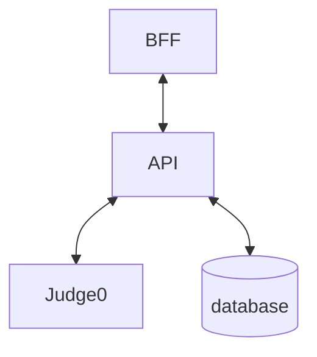
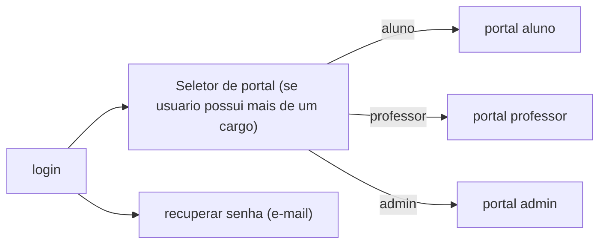
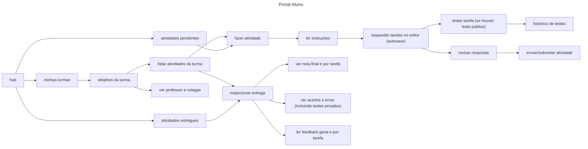
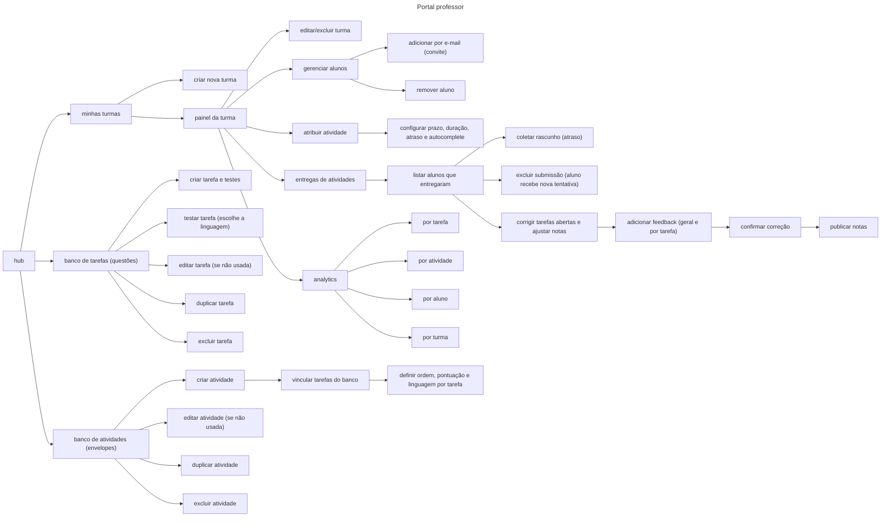
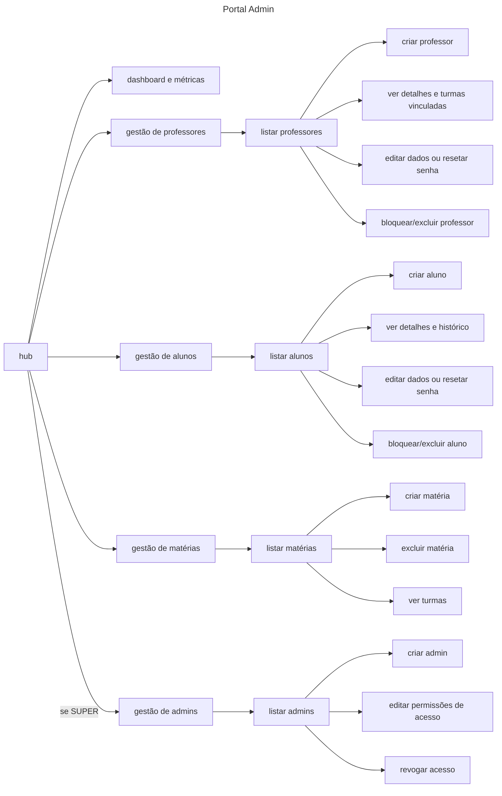
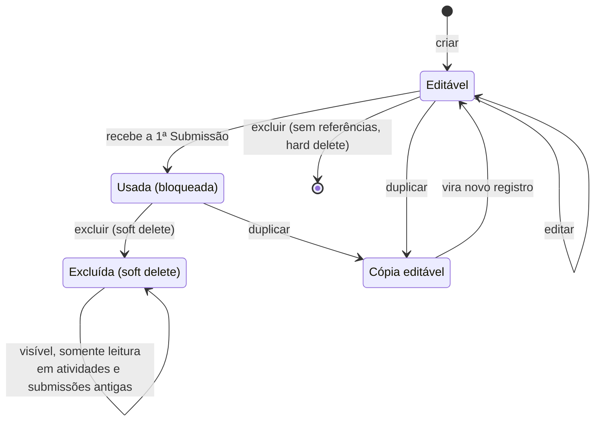

# Seno: Um sistema para envio e correção de provas de programação.
A ideia é produzir um sistema local para a Universidade Federal do Pará. O sistema será um conjunto de ferramentas para o aluno/professor na hora de programar e fazer provas/atividades relacionadas a programação.

## Stack
* Front: Svelte + SvelteKit (a camada de servidor do SvelteKit é o **BFF**)
* API: Golang + Gin
* Banco: PostgreSQL
* Editor: Monaco
* Execução de código: Judge0 (self-hosted, Docker, servidor local da UFPA)

## Features Planejadas
0. Organização de matérias: Admins criam matérias;
1. Organização de turmas: Professores criam turmas de uma matéria e adicionam alunos;
2. Tarefas e Atividades: Professores criam Tarefas de programação e montam atividades (conjunto de tarefas, estilizado através de um json);
3. Editor de texto: Alunos fazem as tarefas em um editor de texto próprio para programação, diretamente na web, com backup automático, syntax highlight e auto-complete (configurável por Atribuição);
4. Testes e Submissões: Alunos podem testar uma tarefa de maneira automatizada e submeter atividades para correção, que executa todos os testes e registra o resultado ao professor;
5. Analytics detalhadas: Professores podem consultar informações sobre taxa de acerto/erro, tempo de entrega, atrasos, etc. sob a perspectiva de Tarefa, Atividade, Aluno e Turma.

### Geral
Tudo que for criado por um usuário terá as seguintes informações de auditoria:
* criado por
* criado em
> [Opcional]
* editado por
* editado em

### Log
Registra qualquer evento de escrita e login. Não registra as execuções de "testar" (têm histórico próprio, ver **Execução de teste**).
* Data hora
* Agente
* tipo
* descrição

### Usuário
Um usuário é um par de login e senha que podem acessar o sistema. O usuário pode ter cargos, que garantem a ele as permissões de perfil. Não existe autocadastro: usuários são criados por admins, ou como **pendentes** quando um professor adiciona um aluno por e-mail (o aluno recebe um convite para definir a senha). A recuperação de senha é feita por e-mail.

* email
* Senha (Hash)
* Cargos (Professor, Aluno, Admin, Super admin) *_ps. Pode ter um ou mais_
* Pessoa
* status (ativo, pendente)
* desativado em

### Pessoa
Uma pessoa é alguém que está cadastrado no sistema, geralmente um **Usuário**.
* Nome
* Sobrenome

### Organização de Matérias
Uma **Matéria** é um título que representa uma cadeira de estudo na faculdade (programação I, programação II, Estrutura de Dados, Banco de Dados, etc.).

V-00:
* código (Ex. PROG1)
* nome

### Período Letivo
Um **Período Letivo** representa o período em que as turmas acontecem. Por enquanto armazena apenas trimestre e ano (a revisar com o calendário real da UFPA).

* trimestre
* ano

### Organização de Turmas:
Uma **Turma** é uma coleção de alunos de uma **Matéria**, em um **Período Letivo**. (PROG)

V-00:
* **Professor**
* **Matéria**
* **Período Letivo**
> [Opcional]
* encerrado em 
* título (T1, T2, T3, etc)

### Matrícula:
Uma **Matrícula** associa um **Aluno** a uma **Turma**. Ao adicionar por e-mail um aluno que ainda não possui usuário, é criado um usuário pendente com convite.

* turma
* aluno
* entrada em
> [Opcional]
* saída em

### Tarefas:
Uma **Tarefa** é uma unidade de trabalho destinado ao **Aluno**. Para disponibilizar uma **Tarefa** ao **Aluno**, ela deve ser envelopada em uma **Atividade**. A linguagem de programação **não** pertence à Tarefa: é definida pelo professor na **Atividade**, por tarefa.

Uma vez que a **Tarefa** foi utilizada em uma *Atividade* que foi atribuida a uma **Turma** e algum **Aluno** fez uma submissão, ela não pode mais ser editada. Nesse caso o professor pode **duplicar** a tarefa para obter uma cópia editável.

Exclusão: se a Tarefa não é referenciada por nenhuma Atividade, é excluída definitivamente (hard delete). Caso contrário, é excluída com soft delete e continua visível, somente leitura, nas Atividades e Submissões antigas.

V-00:
* nome
* enunciado
> [Opcional]
* Tempo de CPU
* Tempo de execução (total)
* Uso de memória
* testes (0..N)

Quando um limite não é definido, vale o padrão global (ver **Limites de execução**).

Uma Tarefa **sem testes** é uma tarefa **aberta**: não há correção automática e o professor preenche a nota manualmente.

### Teste:
Um **Teste** é um caso de teste de entrada e saída. É associado à uma tarefa e pode ser privado (usado internamente para corrigir submissões) ou público (também pode ser usado para o aluno verificar seu código). A comparação da saída é **exata**, nos termos do Judge0; esse comportamento deve ser documentado na tela de criação do teste.

* tarefa
* stdin (texto)
* stdout esperado (texto)
* publico

### Atividades:
Uma **Atividade** é um conjunto de **Tarefas**. Ela é disponibilizada aos alunos através de uma **Atribuição**. A atividade armazena um JSON, que será hidratado pelo backend e depois fornecido ao front, que renderizará as páginas. No momento que uma Atividade recebe uma Submissão, ela não pode mais ser editada (pode ser duplicada). A regra de exclusão é a mesma da Tarefa (hard delete se nunca usada, soft delete caso contrário).

A linguagem é definida **por tarefa** no JSON, uma única por tarefa, e o aluno não a escolhe. Linguagens suportadas na v1: `python`, `c`, `cpp`. O identificador é próprio do Seno e é mapeado para o `language_id` do Judge0 apenas na camada de integração.

V-00:
* Nome
* *Conteúdo*
>[Detalhamento do **Conteúdo** (JSON) NÃO FINAL]
```json
// Pré hidratação (armazenado no banco de dados)
{
  "schema_version": 1,
  "components": [
    {
      "type": "large_large_text",
      "text": "Título da Prova de Programação"
    },
    {
      "type": "task_default", // renderiza número de ordem (1), pontuação, nome e descrição.
      "id": 1234,
      "value_pts": 5,
      "language": "python"
    }
  ]
}
```

### Atribuição:
Uma atribuição conecta uma **Turma** à uma **Atividade**.

* autocomplete (ligado/desligado). Padrão: desligado se a Atribuição tem prazo ou duração (prova), ligado nas demais.
> [Opcional]
* Data-hora prazo
* Data-hora de início
* Tempo de duração
* Pode ser entregue atrasado (MARCADO)

Padrões quando ausentes: sem início, disponível imediatamente; sem prazo, aberta até a turma ser encerrada; sem duração, sem limite além do prazo.

**Prazo efetivo** = `min(comecou em + duração, prazo)`, sempre calculado no servidor. Se a entrega atrasada é permitida, o aluno pode entregar depois do prazo efetivo, sem limite de tempo, e a submissão é apenas marcada como atrasada. Se não é permitida, o aluno não consegue mais enviar: a Tentativa é preservada e o professor a **coleta** manualmente, gerando uma Submissão marcada como atrasada. Não há envio automático nem prorrogação formal.

### Tentativa:
Uma **tentativa** é um relatório sobre o estado atual de uma atividade. É aonde é salvo o progresso de todas as tarefas pelo sistema de backup (além do autosave local no navegador, que reenvia ao reconectar). É excluida assim que uma submissão é feita. Única por (aluno, atribuição).
* Atribuição
* Aluno
* comecou em
* revisão (número incrementado a cada gravação; gravações com revisão antiga são rejeitadas, evitando sobrescrita com duas abas)
* gravado em
* Snapshot
>[Detalhamento do **snapshot** (JSON) NÃO FINAL]
```json
{
  "tasks": [
    {
      "id": 1234,
      "text": "print('hello world!')"
    },
    {
      "id": 5678,
      "text": "print('hello world again!')"
    }
  ]
}
```

### Submissão:
Uma entrega de uma **Atividade** por um aluno por uma **Atribuição**, com uma snapshot das respostas para as **Tarefas** da atividade. Única por (aluno, atribuição). O professor pode excluí-la definitivamente (a Correção é excluída junto); nesse caso o aluno recebe uma nova Tentativa pré-preenchida com o snapshot excluído, mantendo o `comecou em` original. A exclusão é registrada no Log.
* Atribuição
* Aluno
* entregue em
* comecou em
* atrasada
* Snapshot
>[Detalhamento do **snapshot** (JSON) NÃO FINAL]
```json
{
  "tasks": [
    {
      "id": 1234,
      "text": "print('hello world!')"
    },
    {
      "id": 5678,
      "text": "print('hello world again!')"
    }
  ]
}
```
> [Opcional]
* Observação do aluno

### Correção:
Uma correção feita a uma **Submissão** (1 para 1; a Correção aponta para a Submissão). Geralmente gerada automaticamente. Deve ser confirmada pelo professor. Confirmar e publicar são ações distintas. A execução é assíncrona (em lote, com callbacks).

* Submissão
* status (pendente, executando, concluída, falhou)
* Feedback geral do professor
* Correções por tarefa (lista de **Correção de tarefa**)
* criado em
* Confirmada por
* Publicada em

### Correção de tarefa:
* tarefa
* nota automática (`value_pts` se todos os testes passaram, senão 0; vazia em tarefas abertas, sem testes)
* nota final (o professor pode alterá-la livremente, inclusive com nota parcial)
* Feedback do professor (por tarefa)
* Resultados (lista de **Resultado**)

### Resultado:
O resultado associa um **Teste** a um relatório sobre a sua execução em uma correção. Para testes sem submissão, ver **Execução de teste**.

* Correção de tarefa
* teste
* status (veredito do Judge0)
* stdout
* stderr
* saída de compilação
* Tempo de execução
* Uso de memória
* Tempo de CPU

### Execução de teste:
Registro de cada vez que o aluno usa "testar". O aluno vê seu próprio histórico; o professor não. Retenção de 7 dias. Só existe para tarefas com ao menos um teste público; só os testes públicos são executados e exibidos. Limite de 5 execuções por minuto por aluno (todas as tarefas somadas), com mensagem de tempo de espera. O "testar" do professor no banco de tarefas (onde escolhe a linguagem na hora) não gera histórico.

* Aluno
* Atribuição
* Tarefa
* Linguagem
* código
* Resultados (apenas testes públicos)
* data

### Visibilidade dos resultados
* Durante a prova, o aluno só enxerga testes públicos. Em tarefas sem teste público, o botão "testar" não aparece e o aluno não sabe se há testes privados.
* Depois que o professor **publica** a correção, o aluno vê nota final, nota por tarefa, feedback geral e por tarefa, e todos os testes, inclusive os privados.
* A filtragem acontece sempre na API/BFF, e a permissão de "testar" é sempre verificada no servidor.

### Limites de execução
Padrão quando a Tarefa não define (a calibrar com um "hello world" em Python, C e C++ no servidor real):
* Tempo de CPU: 1 s
* Tempo total: 2 s
* Memória: 64 MB (256 MB na compilação de C/C++)

## Backend


* O **BFF** (servidor do SvelteKit) cuida de sessão, cookies e agrega chamadas para o front. Só a **API** fala com o Judge0.
* O Judge0 roda em rede interna, sem acesso à internet, com token e versão atualizada.

### Execução do código
Judge0 (self-hosted), em Docker. Usa submissões em lote e callbacks (sem polling).
* "Testar" e correção compartilham os mesmos workers, com prioridade para "testar".
* Metas: "testar" em até 15 s; correção em até 10 min.
* Dimensionamento de referência: 60 alunos × 6 tarefas × 8 testes = 2.880 execuções por prova.
* Atenção: versões do Judge0 CE podem exigir cgroup v1. Verificar cedo no servidor (`stat -fc %T /sys/fs/cgroup`: `cgroup2fs` é v2, `tmpfs` é v1).

## Requisitos não funcionais
* **Dados (LGPD):** retenção de submissões e logs por 2 anos. Dados de alunos acessíveis apenas ao professor da turma e a admins.
* **Backup:** diário completo, com arquivamento de WAL do PostgreSQL e retenção de 120 dias.
* **Operação:** servidor local com nobreak. Autosave local (IndexedDB) com reenvio ao reconectar.
* **Fora da v1:** detecção de plágio, registro de eventos de aba, restrição por IP, SSO/importação de turmas, prorrogação formal, código inicial (template) por tarefa, número de matrícula em Pessoa.

## Frontend

### Login e seletor de portal 
Não há autocadastro. Recuperação de senha por e-mail.



### Portal Aluno


### Portal professor


### Portal admin


### Fluxo Completo

```mermaid
flowchart LR
    subgraph CAD["Cadastro"]
        M["Admin cria Matéria"] --> TU["Professor cria Turma<br/>(Matéria + Período Letivo)"]
        PL["Admin cria Período Letivo"] --> TU
        TU --> ADD["Professor adiciona aluno por e-mail"]
        ADD --> EX{"Usuário existe?"}
        EX -- "não" --> PEND["Usuário pendente + convite"]
        PEND -- "aluno define a senha" --> ATIVO["Usuário ativo"]
        EX -- "sim" --> MAT["Matrícula criada"]
        ATIVO --> MAT
        MAT -- "remover aluno" --> MATF["Matrícula encerrada<br/>(saída em)"]
    end

    subgraph CON["Conteúdo"]
        TAR["Tarefa criada<br/>(+ Testes públicos/privados)"] --> ATV["Atividade criada<br/>(ordem, pontos, linguagem por tarefa)"]
    end

    subgraph ENT["Aplicação e entrega"]
        ATR["Atribuição criada<br/>(Turma + Atividade)"] --> DISP["Disponível<br/>(início, ou imediatamente)"]
        DISP --> TENT["Tentativa criada<br/>(comecou em)"]
        TENT -- "autosave (revisão +1)" --> TENT
        TENT -- "testar (se há teste público)" --> EXEC["Execução de teste<br/>(retenção 7 dias)"]
        EXEC --> TENT
        TENT -- "aluno envia" --> PRAZO{"Dentro do<br/>prazo efetivo?"}
        PRAZO -- "sim" --> SUB["Submissão"]
        PRAZO -- "não" --> ATRASO{"Atraso<br/>permitido?"}
        ATRASO -- "sim" --> SUBA["Submissão marcada<br/>como atrasada"]
        ATRASO -- "não" --> BLOQ["Envio bloqueado<br/>Tentativa preservada"]
        BLOQ -- "professor coleta" --> SUBA
    end

    subgraph COR["Correção"]
        SUB --> CPEND["Correção: pendente"]
        SUBA --> CPEND
        CPEND --> CEXEC["executando<br/>(Judge0, em lote)"]
        CEXEC --> CCONC["concluída"]
        CEXEC --> CFALHA["falhou"]
        CFALHA -- "reexecutar" --> CPEND
        CCONC --> AJ["Professor preenche tarefas abertas,<br/>ajusta notas e feedback"]
        AJ --> CONF["Confirmada"]
        CONF --> PUB["Publicada"]
        PUB --> VER["Aluno vê notas, feedback<br/>e testes privados"]
    end

    MAT --> ATR
    ATV --> ATR
    SUB -. "Tentativa apagada" .-> TENT
    SUB -- "professor exclui" --> DEL["Submissão e Correção<br/>excluídas definitivamente"]
    SUBA -- "professor exclui" --> DEL
    DEL -- "nova Tentativa pré-preenchida<br/>(comecou em original)" --> TENT
```


### Ciclo de Tarefa e Atividade
